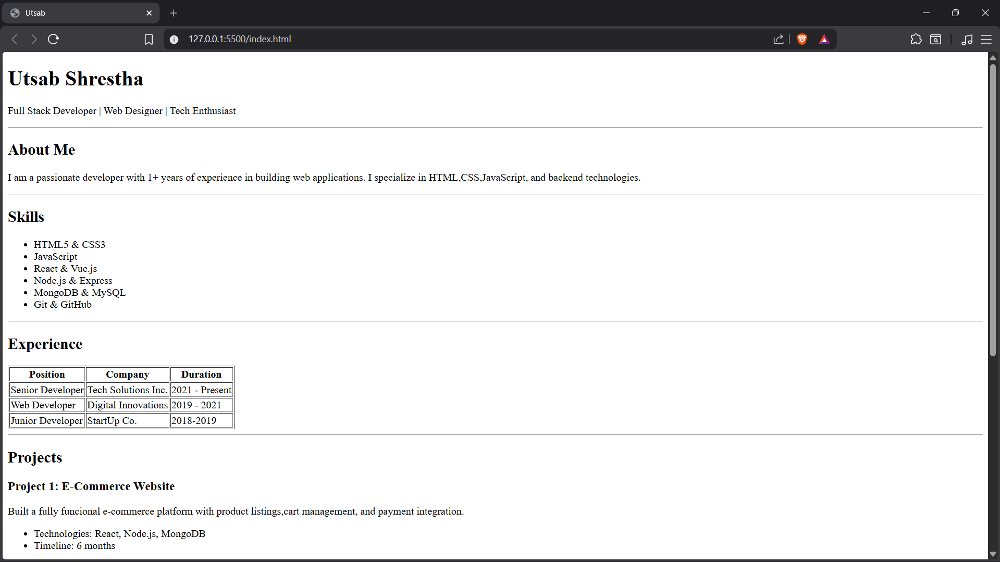
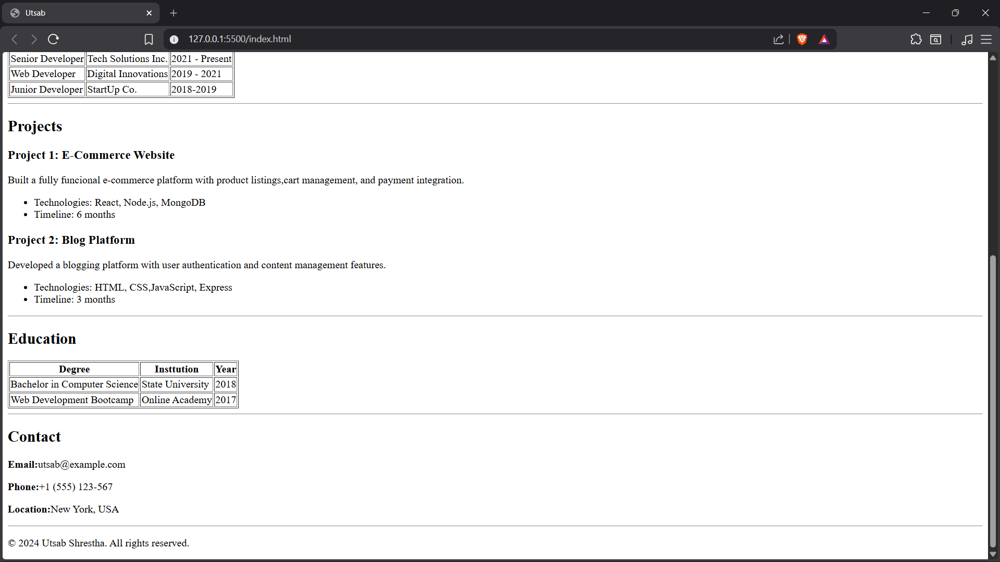

# HTML

# Personal Portfolio Website

This project is a simple **personal portfolio website** built using **pure HTML**.  
It presents personal information, skills, experience, projects, education, and contact details in a structured and semantic manner.

---

## 📌 Demo

- **Screenshots:**
  
  

---

## 🛠️ Technologies Used

- HTML5

---

## 📂 Project Structure

.
├── index.html
└── README.md

---

## ⚙️ Setup Steps

1. Clone the repository:
   ```bash
   git clone https://github.com/UtsabShres/HTML.git
   ```

Navigate to the project folder:

cd HTML
Open index.html in any web browser.

## 📖 Usage

Open the webpage to view:

About Me

Skills

Experience

Projects

Education

Contact Information

This is a static website and does not require any backend or server.
